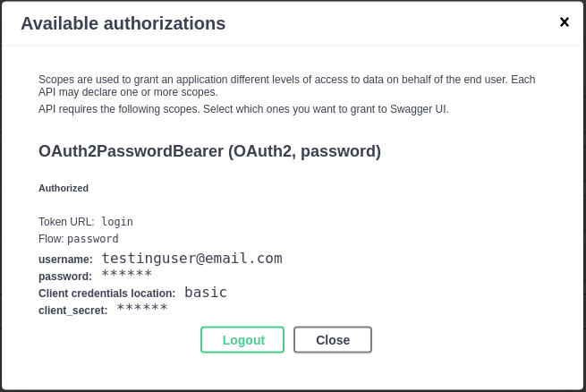

# FastAPI crash course

## Table of Contents

- [About](#about)
- [Getting Started](#getting_started)

## About <a name = "about"></a>

This project comes from Bitfumes crash course on FastAPI. You can find the course in this [link ](https://www.youtube.com/watch?v=7t2alSnE2-I&ab_channel=Bitfumes)

## Getting Started <a name = "getting_started"></a>

To run this project you need to install all [`Python 3.8+`](https://www.python.org/downloads/) and all dependencies in `./app/requirements.txt`. Is recommended to test the application on a virtual environment.
- [Creating virtual environments in Python](https://docs.python.org/3.8/library/venv.html)
- [Installing packages with `requirements.txt` files](https://pip.pypa.io/en/stable/user_guide/)

After creating your virtual environment and installed all dependencies on it, run the following command:
```shell
cd app && uvicorn main: app --reload
```
In your browser, access `http://localhost:8000/docs`. You should land in the following screen:


To execute `POST` requests under `blogs`, you should first register user by clicking on the `POST` button under `users` and then in `Try out`:


Then you type the new `username`, following by it's `email` adress and `password`. Then click on `execute`.


Now you should be able to login. Click on `Authorize` at the right upper corner. The following window should appear:


You will get the following login if you provide the right credentials:


After this you should be able to run `DELETE`, `PUT` and `POST` requests.
